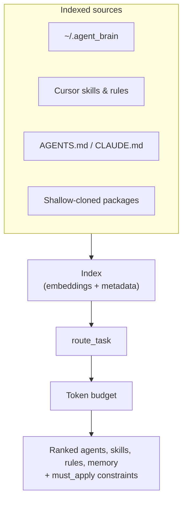
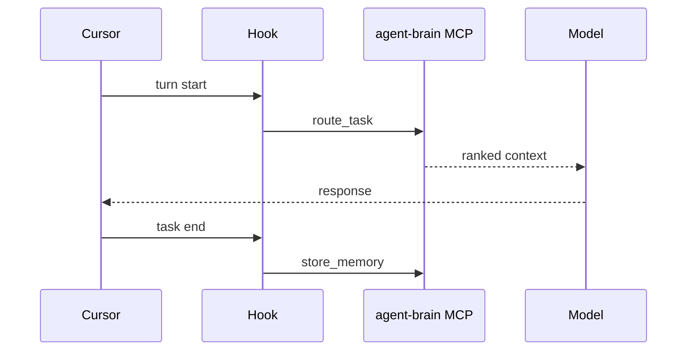
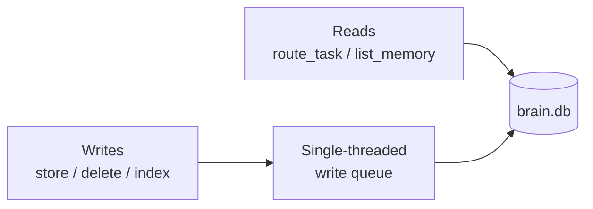

Every agent turn arrives with too much context and not enough signal. Skills, rules, agent definitions, and memory facts compete for the same token budget. Cloud memory SaaS adds latency and another vendor. Dumping everything into the prompt does not scale.

[agent-brain](https://github.com/aeswibon/agent-brain) is a **local MCP server** written in Rust. It indexes agents, skills, rules, and memory from your machine, then answers one question per turn: **what should the model see right now?**

`route_task` returns ranked agents, skills, rules, and memory under a strict token budget. Cursor hooks can enforce calling it every turn. Memory writes go through SQLite WAL. Nothing leaves your machine unless you want it to.

This is **Part 1** of the agent-brain series.

## What problem it solves

Coding agents already have skills folders, rules files, and ad-hoc memory. The failure mode is not missing content — it is **ungoverned retrieval**:

- Wrong skills loaded for the task
- Rules repeated every turn until they crowd out code
- Memory facts that contradict each other
- No durable write path for decisions that should persist across sessions

agent-brain is not an agent framework. It does not plan multi-step workflows or replace the model. It is a **routing layer**: cheap, local, hook-friendly.

## Architecture at a glance



Indexed sources include:

| Source | Paths |
|--------|-------|
| Brain home | `~/.agent_brain/{rules,skills,agents}/` |
| Cursor | `~/.cursor/skills/`, `.cursor/rules/` |
| Claude / Codex | `~/.claude/`, `~/.codex/` |
| Repo | `AGENTS.md`, `CLAUDE.md` |
| Packages | `agent-brain add owner/repo` shallow-clones into `~/.agent_brain/packages/` |

Packages work like optional skill packs. `agent-brain add affaan-m/ecc` indexes hundreds of skills and agents without copying them into every project.

## route_task: the primary tool

Call **`route_task`** every turn with the user message, cwd, and open files. The response includes:

- `recommended_agents`, `recommended_skills`, `applicable_rules`, `relevant_memory`
- `must_apply` — hard constraints from memory that cannot be skipped
- `recommended_phase` — planning vs implementing hint
- `tokens_used`, `tokens_budget`, `cache_hit`, `latency_ms`

The turn cache (LRU, ~60s TTL) makes repeated queries in the same session cheap. Benchmarks in the repo track CI latency — routing should feel instant compared to model time.

`store_memory` persists durable facts at task end (max length enforced, no secrets). `list_memory`, `delete_memory`, and `export_memory` round out the memory lifecycle.

## Why Rust + MCP

MCP fits Cursor's tool model: JSON-RPC on stdout, long-lived `serve` process, stderr for logs. Rust gives:

- Fast cold start after the embedding model loads
- SQLite WAL for concurrent reads during writes
- Single binary distribution via `cargo install` or install script

On macOS, release builds need adhoc signing so Cursor's taskgate does not kill the binary — `make release-macos` and `agent-brain doctor --fix` handle that operational detail.

First run downloads the `AllMiniLML6V2` embedding model via fastembed (~90MB). After that, indexing is local.

## Hook enforcement

Routing only works if the agent actually calls it. agent-brain ships hook integration so Cursor runs `route_task` at turn start and can require `store_memory` at task end for durable outcomes.

That is a deliberate design choice: **routing is policy**, not a suggestion. Without enforcement, agents skip retrieval and you are back to bloated prompts.



## Concurrency model

Writes serialize through a **single-threaded write queue** so `brain.db` mutations never race. Reads (`route_task`, `list_memory`) use a shared store mutex and can run concurrently with the queue, but never interleave writes.



Bootstrap indexing can run in the background (`AGENT_BRAIN_BOOTSTRAP_BG`) so MCP `serve` stays responsive on first connect.

## Packages and auto-update

`~/.agent_brain/config.yaml` can enable auto-update for packages and the MCP binary:

```yaml
auto_update:
  enabled: true
  interval_hours: 24
  packages:
    enabled: true
  mcp:
    enabled: true
    repo: aeswibon/agent-brain
    restart_after_update: true
```

After an MCP self-update during `serve`, the process restarts when idle so Cursor reconnects without a full IDE restart. That is a small detail, but it matters for "install once and forget" ergonomics.

## How it differs from other approaches

| Approach | agent-brain position |
|----------|---------------------|
| Cloud memory SaaS | Local-first, no network round-trip per turn |
| Vector DB in every project | One brain home, shared across repos |
| Manual @-mention skills | Automatic ranking by task description |
| Giant system prompt | Token budget with eviction |

It composes with ECC-style skill packs, Cursor rules, and project-level `AGENTS.md` — it does not replace them.

## MCP tools surface

Phase 1 tools:

- `route_task` — primary retrieval
- `get_context` — lower-level flat context
- `store_memory` / `list_memory` / `delete_memory` / `export_memory`
- `explain_last_context` — debug last routing decision
- `report_context_useful` — feedback loop hook
- `route_to_mcp` — explicit upstream MCP proxy with truncation
- `promote_to_skill` — stage memory as skill draft

`route_to_mcp` never auto-executes from the router — the agent must call it explicitly, keeping side effects visible.

## Installation path

Normal Cursor use does **not** require a terminal `serve` session:

```bash
curl -fsSL https://raw.githubusercontent.com/aeswibon/agent-brain/master/scripts/install.sh | bash -s -- --global
# restart Cursor → enable agent-brain in MCP settings
```

Cursor spawns `agent-brain serve` when needed. Use manual `serve` only for debugging outside the IDE.

## What I am building toward

The README positions agent-brain as Phase 1: routing + memory + packages. Deeper topics — session ingest, promotion workflows, multi-brain sync — are on the roadmap. The invariant for now: **every turn gets ranked context under budget**, and **durable decisions have a write path**.

## What is next in this series

Follow-up posts will cover:

- Indexing and embedding trade-offs
- Memory scopes, polarity, and `must_apply`
- Hook configuration in Cursor
- Package manifests and ECC integration
- Benchmarks and latency tuning

**Repo:** [github.com/aeswibon/agent-brain](https://github.com/aeswibon/agent-brain)
