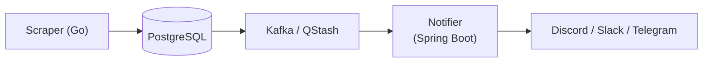
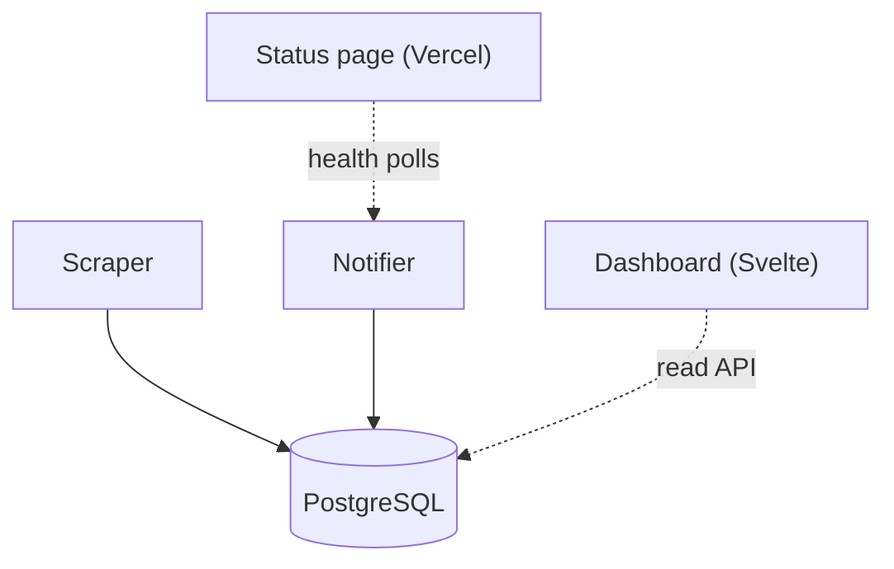
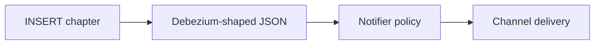
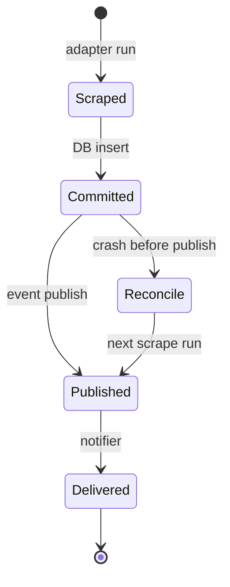

Manga chapters do not arrive in one place. Official simulpubs land on Manga Plus. Community metadata lives on MangaDex. Aggregators like MangaFire, MangaPill, and MangaTown each have different HTML layouts. Scanlation groups post to sites like Asura Scans on their own schedule.

I was tired of opening six tabs every evening. So I built [manga-cdc](https://github.com/aeswibon/manga-cdc): a change-data-capture-style pipeline that scrapes sources on a schedule, diffs against PostgreSQL, publishes chapter events through Kafka or QStash, and routes notifications to Discord, Slack, or Telegram.

This is **Part 1** of the manga-cdc series — the architecture story and the decisions that shaped it.

## The problem is not "write a scraper"

A Discord webhook script breaks the moment you care about reliability:

| Failure | What happens |
|---------|----------------|
| Duplicate notifications | Retries and republication look like new chapters |
| Lost notifications | Process crashes between DB write and webhook |
| Untrusted writes | Public webhook endpoints get probed |
| Ops blindness | A source silently returns zero rows for a week |
| Deploy fragility | Secrets and URLs hard-coded in one file |

manga-cdc treats this as a **small distributed system**: ingest, durable state, event delivery, policy layer, operator UI.

That framing matters. The goal was never "minimum lines of Go." It was **provable end-to-end behavior** on real sites, with a credible path toward true CDC later.

## The four-box architecture

At the center is a pipeline with clear boundaries:

Two edge surfaces sit on top:

- **Dashboard** (Svelte) — operator UI with a BFF proxy to the read API
- **Status page** (Vercel) — public pipeline health for you and contributors

### Why Go for scraping and Java for notifications?

The scrape path is **stateless batch work**: adapters, diff engine, optional publish. It runs on a schedule, exits, and should fail in isolation — a broken MangaTown adapter must not take down notification delivery.

The notifier is **long-lived policy + HTTP**: webhook consumers, channel routing, per-series preferences, read APIs for the dashboard. Spring Boot fits that operational profile, and the split gives each side a clear scaling unit.

PostgreSQL stays **authoritative**. The event bus decouples scrape latency from notify latency. That is the same shape as application-level CDC:

Phase 3 may add WAL CDC with Debezium. Phase 1 deliberately uses application publish so we can run serverless and keep costs near zero.

## Six sources, one adapter contract

Each source adapter implements the same contract: return normalized series and chapter rows. Behind that interface, everything is different:

| Source | Access model | Stability risk |
|--------|--------------|----------------|
| MangaDex | Official API | Rate limits, API versioning |
| Manga Plus | Official API | Regional availability |
| MangaFire | HTML scraping | Layout changes |
| MangaPill | HTML scraping | Anti-bot behavior |
| MangaTown | HTML scraping | Pagination quirks |
| Asura Scans | HTML scraping | Irregular release timing |

The diff engine compares incoming rows against PostgreSQL. New chapters get inserted, flagged, and published. The design doc calls this **Real > Impressive**: fixture tests are necessary, but tagged releases still run against live behavior.

## Consistency: what is actually guaranteed

This pipeline is **not** linearizable end-to-end. That is fine — but you have to know the gaps:

| Step | Guarantee |
|------|-----------|
| DB insert of new chapter | ACID per transaction |
| Event publish after insert | Best effort in-process |
| Notifier delivery | At-least-once with idempotent handlers |
| Dashboard freshness | Cached read path |

A crash after commit but before publish leaves `is_new` true for the next run to reconcile. Notification handlers dedupe on chapter identity so retries do not spam channels.

Operators see health through the status page and pipeline health endpoints — because silent scrape failure is the most common production incident class.

## Notification policy, not just delivery

The notifier is more than a webhook forwarder. It implements:

- **Per-series preferences** — which channels, which series, batching rules
- **Channel adapters** — Discord, Slack, Telegram with separate formatting
- **Mutation guards** — write APIs protected when mutations are disabled in prod
- **Notification log** — audit trail of what was sent and why

The dashboard proxies read APIs so browser clients never hold service credentials. The status page polls pipeline health into a Vercel-friendly KV model for public visibility.

## Deployment and the cost profile

Phase 1 optimizes for **BYO data plane** and **scale-to-zero** where possible:

- Scraper as a scheduled job (Railway, Cloud Run job, cron)
- PostgreSQL on Neon, Supabase, or self-hosted
- Kafka on Upstash or QStash as a lighter alternative
- Notifier on Cloud Run
- Dashboard and status on Vercel

Terraform modules exist for multiple clouds — not because multi-cloud is fun, but because portability is part of the credibility goal. The env parsing patterns are shared; the topology is the same.

CI is a release train: PR validation, image builds, Helm charts, and e2e gates on tagged releases. The project even dogfoods cross-repo orchestration patterns (more on that in the pipeline-compose series).

## What I would do differently

If I started today with only personal use in mind, I might defer Kafka and use QStash-only eventing longer. The abstraction still pays off — switching buses should not require rewriting the diff engine — but operating Kafka for a single-tenant setup is real overhead.

I would also ship the watchlist contribution flow earlier. Community series discovery is the main growth loop for a project like this.

## What is next in this series

Future posts will go deeper into:

- Source adapter design and scrape SLOs
- The dual-write path and idempotency contracts
- Notification filter graph and auth model
- CI/CD gates and the release train
- The Phase 2/3 roadmap (SaaS, true WAL CDC)

If you are building something that looks like "scrape → diff → notify," the manga-cdc architecture docs are the design record. Start with [the architecture reading guide](https://github.com/aeswibon/manga-cdc/tree/master/docs/architecture) on the repo.

**Links:** [GitHub](https://github.com/aeswibon/manga-cdc) · [Dashboard](https://manga-cdc.vercel.app) · [Status](https://manga-cdc-status.vercel.app)
