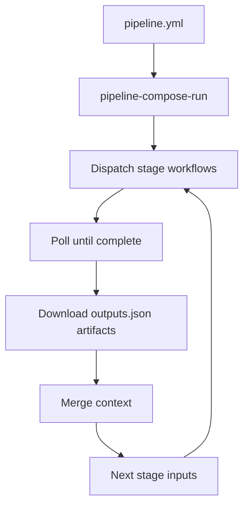
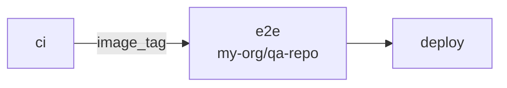
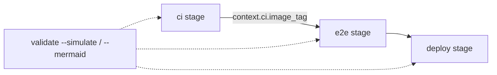

Inside one repository, `needs:` is enough. Your CI graph is visible, failures propagate, and job outputs wire downstream steps.

The moment a release spans **multiple repositories** — application repo, QA repo, infra repo — you fall back to `repository_dispatch`, PAT maps, and bash that polls `gh run view`. Fire-and-forget dispatch does not wait. `workflow_call` does not cross repo boundaries. The pipeline order lives in wiki tables instead of code.

I built [pipeline-compose](https://github.com/aeswibon/pipeline-compose) to close that gap **without** introducing Jenkins, Buildkite, or a second CI platform. It is declarative YAML, GitHub Actions execution, and a small set of composable actions.

This is **Part 1** of the pipeline-compose series.

## The coordination failures Actions does not solve

| Symptom | Root cause |
|---------|------------|
| Library PR cannot gate on consumer E2E | No cross-repo `needs:` |
| Release spans app + infra repos | `workflow_call` stays in one repo |
| "Did repo B finish?" | `repository_dispatch` is async from repo A's view |
| Pipeline order in runbooks | Graph is implicit across workflow files |
| Re-run after stage 9 fails reruns 1–8 | No resume DAG across workflow runs |

These are **coordination** problems. GitHub Actions is still the right execution engine. What was missing was a **synchronous orchestrator** with a stable context contract.

## The mental model



You keep your existing stage workflows. You add:

1. `.github/pipelines/pipeline.yml` — the graph
2. `pipeline-compose-export` in stages that produce outputs
3. `pipeline-compose-run` in an entry workflow (tag push, manual, PR)

The run action dispatches each stage, **polls until completion**, downloads `pipeline-compose-<stage>` artifacts, and builds `context.<stage>.<key>` for downstream `inputs`.

That is the product: not a new runner, but a **deterministic DAG scheduler** in one Node process.

## A minimal pipeline

```yaml
version: 2
pipelines:
  release:
    stages:
      - id: ci
        workflow: .github/workflows/ci.yml

      - id: e2e
        workflow: .github/workflows/e2e.yml
        repo: my-org/qa-repo
        needs: [ci]
        inputs:
          image_tag: ${{ context.ci.image_tag }}

      - id: deploy
        workflow: .github/workflows/deploy.yml
        needs: [e2e]
```

The `ci` stage exports an image tag:

```yaml
- uses: aeswibon/pipeline-compose-export@v1.13.0
  if: success()
  with:
    stage_id: ci
    outputs: '{"image_tag":"${{ steps.build.outputs.tag }}"}'
```

The entry workflow runs the graph:

```yaml
- uses: aeswibon/pipeline-compose-run@v1.13.0
  with:
    pipeline_file: .github/pipelines/pipeline.yml
```

One parent run. Visible child runs per stage. Failure in `e2e` fails the pipeline — unlike raw dispatch.



## Why dispatch-per-stage instead of one mega-workflow?

| Jobs in one workflow | Dispatch per stage |
|---------------------|-------------------|
| Single `GITHUB_RUN_ID` | One run ID per stage (per-team visibility) |
| Native `needs:` | API polling required |
| Same token scope | Per-repo token/client |
| Hard to reuse existing workflows | Keeps workflows you already run manually |

We chose dispatch because the promise is **"keep your workflows"** and **cross-repo** without regenerating a monolithic YAML file on every change.

Stages in the same wave run in parallel under `Promise.all`. Context merges **after** the wave completes — same invariant as parallel GitHub jobs that must not depend on each other's outputs mid-wave.

## Context is a contract, not a convention

If a stage references `context.ci.image_tag` and that key is missing, the run action **throws**. No silent empty strings sent to deploy scripts.

Export standardizes on `outputs.json` artifacts. Validate can simulate the graph before merge — skips, waves, missing context — and emit Mermaid for PR comments. That closes the loop for teams who previously discovered wiring bugs only after a failed release night.



## Cross-repo authentication

Cross-repo stages need credentials. pipeline-compose supports:

- **GitHub App** installation tokens (recommended) — least-privilege, rotatable
- **`repo_tokens_json`** — explicit PAT map when App setup is not ready

The tutorials in the repo walk through App auth and a full cross-repo echo example. Validation with `--check-repo-access` fails CI when a stage points at a repo the token cannot reach.

## Monorepo layout: core + action repos

The local monorepo (`action-order` on disk, published as `@aeswibon/pipeline-compose-*`) splits:

| Package | Role |
|---------|------|
| `packages/core` | Parse, validate, simulate, compile — single semantic source |
| `packages/cli` | `init`, `validate`, `import turbo`, `smart_rerun` |
| `action-run` | Orchestrator |
| `action-export` | Artifact contract |
| `action-compile` | Optional static workflow generation |
| `action-eval` | `when:` expressions |
| `action-context-merge` | Manual context JSON |

Each action ships as its own GitHub repo for `uses: aeswibon/pipeline-compose-run@v1.13.0` ergonomics. The monorepo is the development source of truth; releases are coordinated across action repos.

## Developer ergonomics that mattered

| Tool | Why |
|------|-----|
| `validate --strict --workflows` | Schema + DAG + orphan detection in CI |
| `validate --simulate` | Dry-run stage table before merge |
| `validate --mermaid` | Topology in PRs |
| `catalog` / `catalog_from` | Reuse stage templates |
| `import turbo` / `import nx` | Generate YAML from task graphs |
| `smart_rerun` | Re-run failed pipelines, reuse unchanged stages |
| `context_schema` | Typed wiring with optional runtime checks |

This repo dogfoods its own PR bot workflow — pipeline YAML changes get simulate + mermaid comments automatically.

## What pipeline-compose is not

Explicit non-goals from the design docs:

- Replace GitHub job sandboxing or build caching (Turbo/Nx own that layer)
- Host a remote workflow registry
- Guarantee exactly-once side effects across stages
- Provide a global pause/approve UI

Single-repo linear CI should keep using native `needs:`. Full deployment platforms (Spinnaker, Argo CD) are out of scope.

## Alternatives I considered

**Monolithic mega-workflow** — fine in one repo; does not generalize.

**repository_dispatch + custom pollers** — every team reimplements wait, timeout, and context merge. pipeline-compose is the extracted poller with tests.

**Third-party CI** — solves orchestration but loses Actions billing visibility, secret stores, and incremental adoption.

## How I use it

manga-cdc's release train and multi-image builds are a natural fit. Platform teams can publish a **stage catalog**; product repos import stages without copying workflow YAML. Meta-release tooling in the monorepo even pipelines releases of the action repos themselves.

## What is next in this series

Planned deep dives:

- Run path vs compile path
- Context and export contract edge cases
- Cross-repo auth with GitHub Apps
- Validation, simulate, and the PR bot
- Smart rerun and sub-pipelines

**Repo:** [github.com/aeswibon/pipeline-compose](https://github.com/aeswibon/pipeline-compose)  
**Stable release:** v1.13.0
